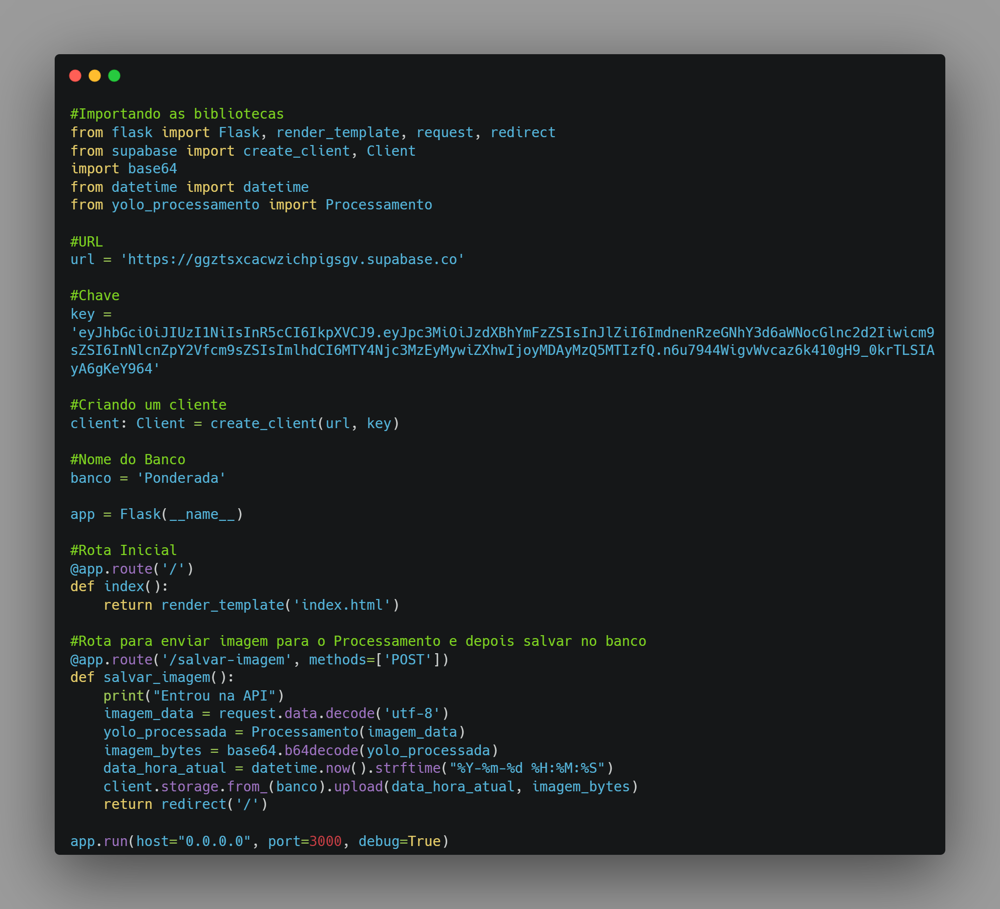
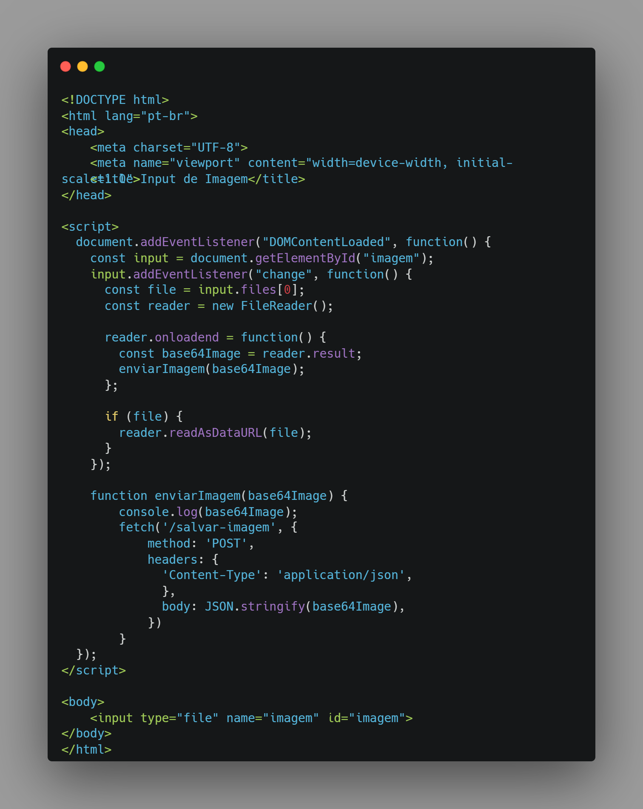
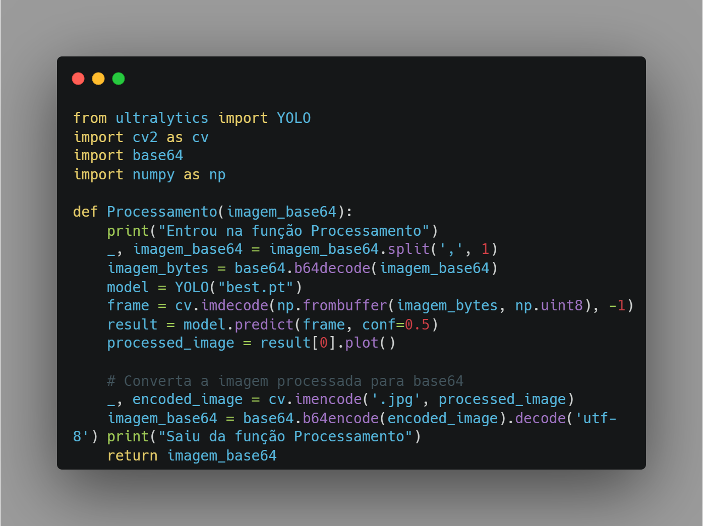

<table>

<tr>

</td>

  

<td>

</td>

</tr>

</table>

  

Backend para transmissão e armazenamento de imagens

  

# **Sumário**

  

- [Autores](#autores)

- [Visão Geral do Projeto](#visão-geral-do-projeto)

- [Objetivos](#objetivos)
  

- [Instalação de Ambiente](#instalação-de-ambiente)

- [Desenvolvimento](#desenvolvimento)

  
- [Referências](#referências)

  

# Autores

  

Kil Matheus Gomes Teixeira

  

# Visão Geral do Projeto

## Proposta

A fim de proporcionar aprendizado prático aos alunos do 2º ano do curso de Engenharia da Computação, o Instituto de Liderança e Tecnologia - INTELI, juntamente com o professor de programação Rodrigo Mangoni Nicola, propôs uma atividade desafiadora que busca aplicar os conhecimentos adquiridos sobre ambiente ROS2 (Ambiente de Programação de Desenvolvimento de Sistemas Robóticos) e Ubuntu.

# Objetivos

Desenvolva o software de um backend capaz de receber imagens e armazená-las adequadamente. Não há restrições com relação à tecnologia utilizada.

## Requisitos

Segundo o card do AdaLove do prof. Rodrigo Mangoni Nicola, os requisitos são descritos como seguintes:

Padrão de Qualidade:

Para esta atividade, espera-se a capacidade demonstrável de desenvolvimento de um backend capaz de interagir (não necessariamente em tempo real) com um sistema de visão computacional. A entrega deve ser um vídeo demonstrando o funcionamento do projeto, um texto conciso descrevendo como foi feita a implementação e o link para o repositório público no github onde foi feita a implementação.

1.  Setup das rotas do backend. (peso 1)
2.  Manipulação adequada da imagem de acordo com a estratégia escolhida (arquivos completos, frames) e integração com a rota do backend. (peso 2)
3.  Armazenamento adequado da imagem. (peso 2)
4.  Explicação coerente e concisa da implementação (min 250 caracteres e máximo 1500); (peso 3)
5.  Congruência entre o que foi escrito e o código disposto no repositório do github; (peso 2)

## Instalação de Ambiente

### Yolo V8

YOLO é uma abreviação para "You Only Look Once" ("Você Só Olha uma Vez", em tradução livre). É um dos algoritmos mais populares e eficientes para detecção de objetos em imagens e vídeos em tempo real.

O YOLO utiliza uma rede neural convolucional para realizar a detecção de objetos em tempo real. Essa rede é treinada em um grande conjunto de dados rotulados, onde as imagens são anotadas com caixas delimitadoras e classes correspondentes. Durante a inferência, o YOLO processa a imagem inteira de uma só vez e retorna as previsões das caixas delimitadoras e suas classes associadas.

### OpenCV

O OpenCV (Open Source Computer Vision) é uma biblioteca de código aberto. O objetivo principal do OpenCV é fornecer um conjunto de funções e algoritmos que facilitem a implementação de aplicações de visão computacional, como detecção de objetos, reconhecimento facial, calibração de câmera, rastreamento de movimento, entre outros.

### Flask

O Flask é um framework web em Python usado para desenvolvimento de aplicações web. Ele é leve, simples e fácil de usar, o que o torna uma escolha popular para a criação de sites e serviços web.

## Desenvolvimento

Para podermos atingir o nosso objetivo, precisamos primeiramente criar um Back-end capaz de suportar um Front-end na qual tenha a capacidade de fazer uploads de imagens, que a mesma seja processada no pelo OpenCV, que já está configurado com um modelo treinado para identificar objetos em uma imagem, que no caso, seria rachaduras, reaproveitando o desenvolvimento da ponderada 3.

Primeiramente, para fazermos a instalação da nossa aplicação em Flask, foi seguido os passos demonstrados no seguinte slide do Encontro de Programação 5 do Professor Murilo Zanini de Carvalho ainda referente o módulo 5.

 Encontro de Programação 5: Acompanhamentos de Testes e Documentação.
https://drive.google.com/file/d/1LzHLwFraq6Jaljs04x-evlYDag_Lr7vO/view?usp=sharing

Após a instalação dos diretórios do Flask, foi criada uma pasta chamada <b>src</b>, onde dentro da mesma, foi criado um documento Python com o seguinte código. Ele é o nosso Backend da aplicação com as suas regras de negócio (Rotas).

Fonte: Código Principal, Autoria Própria.

Em resumo, ele serve o nosso Front-end, qual espera que o usuário input uma imagem, que será transformada em base64 para facilitar o envio, e a mesma será enviada para o Back-end pela rota <b>'/salvar-imagem'</b> onde após todo o processamento da imagem, ele envia para o banco de dados SupaBase.

Fonte: Código do Front-end, Autoria Própria.

Falando um pouco sobre a função de processamento de imagem, o documento Python <b>yolo_processamento</b> ele recebe a imagem em base64 vindo do Front-end e enviado pelo Back-end, ele converte para o arquivo original, processa em um modelo treinado para detectar rachaduras, converte novamente para base64, e devolve de volta para o back.

Fonte: Código Principal, Autoria Própria.

O vídeo mostrando a funcionalidade da aplicação está no link abaixo:
https://drive.google.com/file/d/1EH9GexI2U4ZnxSUmT4NbeOUZz8GkHBaX/view?usp=sharing

## Referências

TEIXEIRA. Kil Matheus Gomes.Backend para transmissão e armazenamento de imagens. Repositório Github. Disponível em: [https://github.com/Kil-Matheus/Ponderada_4_Backend_Armz_Img](https://github.com/Kil-Matheus/Turtlesim---Desenhando-com-Caminho.git). Acesso em: 15 junho 2023.

NICOLA,  Rodrigo Mangoni (2023). Ponderada 3 - # Processamento de imagens e detecção de objetos . Instituto de Tecnologia e Liderança - INTELI. Disponível em: https://github.com/Murilo-ZC/Questoes-Trabalhos-Inteli-M6/tree/main/ponderada4
Acesso em: 15 junho 2023. 